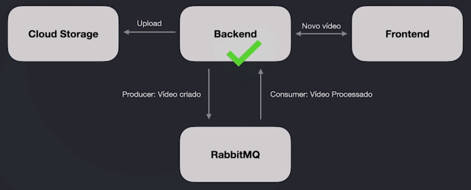
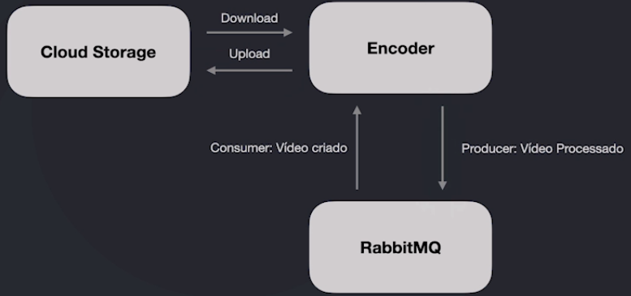
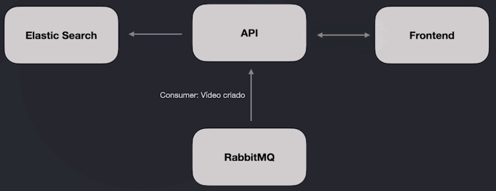
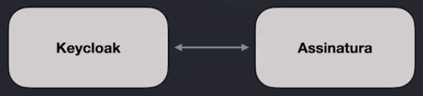
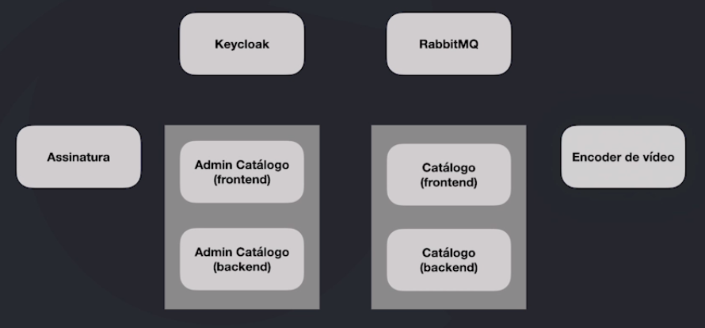
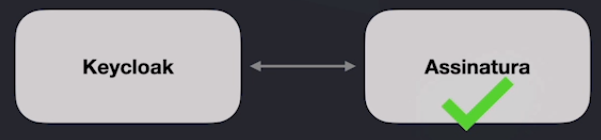
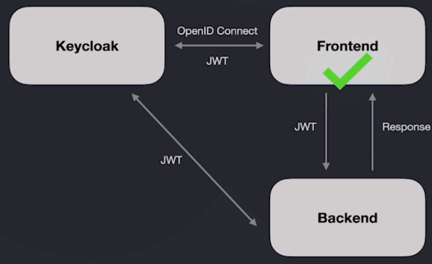
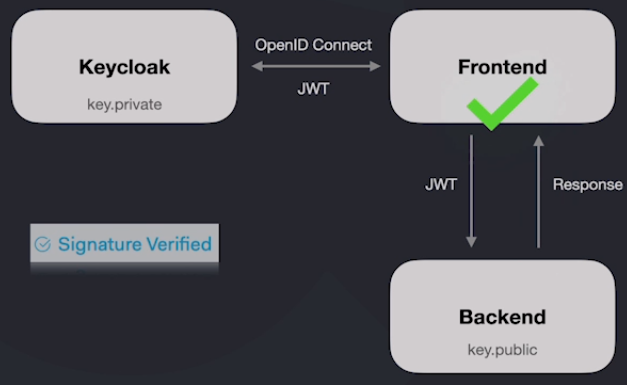

# Arquitetura do projeto prático - Codeflix
---
- Uma espécie de Netflix
- Assinatura do serviço pelo cliente
- Catálogo de vídeos para navegação
- Playback de vídeos
- Busca full text no catálogo

--

- Processamento e encoding dos vídeos
- Administração do catálogo de vídeos
- Administração do serviço de assinatura
- Autenticação

### Decisões de projeto e de arquitetura

**Microsserviços**
- Arquitetura baseada em microsserviços
- Tecnologia adequada para cada contexto (ex: Golang para processar vídeos)
- Não existe uma única verdade na escolha das tecnologias
- Microsserviços podem ser substituidos por outros com tecnologias diferentes
- Cada microsserviço terá seu próprio processo de CI/CD

**API Gateway**
- Acesso externo aos microsserviços através do Ingress do Kubernetes /Istio como API Gateway
- Único ponto de acesso direto as aplicações
- Controle de tráfego
- Rate limit
- Políticas de Retry
- Etc

**Service Discovery**
- Não haverá a necessidade de trabalhar com um sistema de Service Discovery como "Consul"
- O projeto utilizará o Kubernetes para orquestrar os containers, logo Service Discovery já faz parte do processo

**Escala horizontal**
- O processo de escala poderá ser configurado a nível de microsserviço
- Todos os microsserviços trabalharão de forma "Stateless"
- Quando utilizado upload de qualquer tipo de asset, o mesmo será armazenado em um Cloud Storage
- O processo de escala se dará no aumento na quantidade de PODs do Kubernetes
- O processo de autoscaling também será utilizado de um recurso chamado HPA (Horizontal Pod Autoscaler)
- Todos os logs gerados serão persistidos em sistemas externos como Prometheus e Elasticsearch

**Consistência eventual**
- Grande parte da comunicação entre os microsserviços será assíncrona
- Cada microsserviço possuirá sua própria base de dados
- Eventualmente os dados poderão ficar inconsistentes, desde que não haja prejuízo direto ao negócio

**Duplicação de dados**
- Eventualmente um microsserviço poderá persistir dados já existentes em outro microsserviço em seu banco de dados
- Essa duplicação ocorre para deixar o microsserviço mais autônomo possivel
- O microsserviço duplicará apenas os dados necessários para seu contexto
- No caso da Codeflix utilizaremos o Kafka Connect como replicador de dados

**Mensageria**
- Como grande parte da comunicação entre os microsserviços é assíncrona, um sistema de mensageria é necessário
- O RabbitMQ foi escolhido para esse caso
- Por que não o Apache Kafka ou Amazon SQS, entre outros?
    - Apache Kafka também poderia ser utilizado nesse caso, por outro lado, muitos recursos que ele poderia prover não seriam utilizados
    - Evitaremos ao máximo o Lock-in nos cloud providers, logo, Amazon SQS e similares foram descartados
    - Não há uma verdade única sobre a escolha realizada

**Resiliência e self healing**
- Para garantir resiliência caso um ou mais microsserviços fiquem fora do ar, as filas serão essenciais
- Caso uma mensagem venha em um padrão não esperado para determinado microsserviço, o microsserviço poderá rejeitá-la e automaticamente a mesma poderpa ser encaminhada para uma dead-letter queue.
- Pelo fato do Kubernetes e Istio possuitem recursos de Circuit Breaker, Liveness e Readiness probes:
    - Se um container tiver um crash, automaticamente ele será reiniciado ou mesmo recriado
    - Caso um container não aguente determinado tráfego, temos a opção de trabalhar com Circuit Breaker para impedir que ele receba mais requisições enquanto está se "curando"

**Autenticação**
- Serviço centralizador de identidade opensource: KEYCLOAK
- OpenID Connect
- Customização do tema
  - Utilização do create-react-app
- Compartilhamento de chave pública com os serviços para verificação de autenticação dos tokens
- Diversos tipos de ACL
- Flow de autenticação para frontend e backend

### Microsserviços
- Backend Admin do Catálogo de Video (Backend com Laravel)
- Frontend Admin do Catálogo de Videos (Frontend com React)
- Encoder e Vídeo com Golang
- Backend API do Catálogo (Backend com Node.js)
- Frontend do Catálogo (Frontend com React.js)
- Assinatura do Codeflix pelo cliente (Python com Django)
- Autenticação entre Microsserviços com Keycloak
- Comunicação assíncrona entre os Microsserviços com RabbitMQ
- Replicação de dados utilizando Apache Kafka e Kafka Connect

##### Catálogo de vídeos

##### Encoder de vídeos

##### API/App do Catálogo

##### Assinatura do CodeFlix

##### Dinâmica geral dos microsserviços

### Teste
- Unidade
- Integração
- End-to-end
- Selenium/frontend
- Upload

### Autenticação

##### Como os microsserviços se autenticam?

**Qual o grande problema dessa abordagem?**
A cada requisição, o backend precisa validar o JWT no Keycloak.

Resolução:

### Ambiente de desenvolvimento
- Docker é o protagonista do ambiente de desenvolvimento
- Permite a rápida criação do ambiente
- Garante que os ambientes serão exatamente os mesmos
- Facilita a criação de recursos periféricos como banco de dados, RabbitMQ, etc
- Geração de imagens para o ambiente de produção

### CI/CD
- Para cada pull request gerada em uma aplicação, iniciaremos o processo de CI
- Github Actions
- O processo de CI será capaz de:
  - Subir a aplicação usando Docker
  - Executar os testes
  - Utilizar o Sonarqube
- No caso de acontecer o "merge" da Pull Request, o processo de CD acontece
- Fará a geração da imagem Docker
- Realizará o upload da imagem em um container registry
- Executará o deploy no Kubernetes

### Kubernetes
- Cluster Kubernetes gerenciado
- O deploy da aplicação
- Startup, Readiness e Liveness Probe para self healing
- Horizontal Pod Autoscaler (HPA) para escalar horizontalmente a aplicação
- TLS/SSL com cert-manager
- Kubelens para ter uma visão geral do Cluster

### Service Mash
- Istio
- Gerenciamento de tráfego
  - Virtual Service
  - Ingress Gateway
  - Envoy Sidecar Proxy
  - Circuit Breaking
  - Requests Timeout
- TLS/SSL com cert-manager

### Cloud Providers
- Providers
  - AWS
  - GCP
  - Azure
- Importante
  - Isso não é um curso de cloud computing/providers
  - Utilizaremos os recursos necessários para que possamos realizar o deploy das aplicações
  - A idéia é deixar o aluno familiarizado com os providers

### Observabilidade
- Métricas
- Logs
- Tracing/APM (Rastreabilidade)

##### Métricas
- Prometheus/Grafana
- Elastic Stack

##### Logs
- Elastic Stack
  - Elastic Search
  - Beats
  - Kibana

##### Tracing/APM
- Elastic Stack
  - Elastic Search
  - Beats
  - Kibana
  - APM

##### Service Map
- Elastc
- Kiali
  